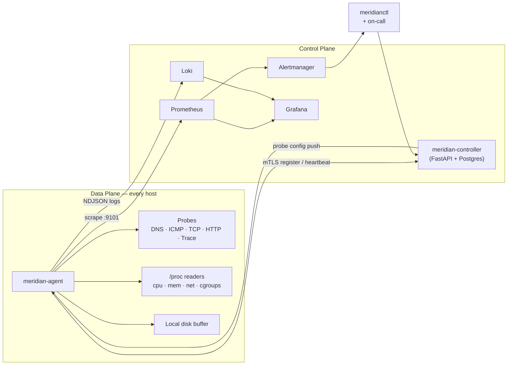

<div align="center">

# Meridian

**Production Reliability & Network Telemetry Platform**

[](.github/workflows/ci.yml)
[](#testing)
[](pyproject.toml)
[](LICENSE)
[](https://github.com/astral-sh/ruff)
[](pyproject.toml)

*Agent-based observability + synthetic network telemetry for Linux fleets.
SLO-driven alerting, disk-backed buffering, chaos-tested.*

</div>

---

## What Meridian is

Meridian is an end-to-end reliability platform that **monitors Linux fleets and the network paths between them**. It runs on every node, ships uniform telemetry through a Prometheus-compatible pipeline, and drives alerts against formally-defined SLOs — not threshold heuristics.

It is not a Prometheus replacement. It is the operational platform built **on top of** Prometheus, Alertmanager, Loki, and Grafana, with the pieces that those tools deliberately leave out: a per-host agent that runs synthetic probes (DNS / ICMP / TCP / HTTP / traceroute) and collects deep `/proc` telemetry, a central controller that distributes probe configuration and tracks incidents, an SLO catalog as code, and a chaos harness wired into CI.

## Architecture at a glance



## Why this exists (and what it signals)

Meridian was built to demonstrate the operational and engineering practices that matter in real production environments: **control-plane / data-plane separation, SLOs as code, blameless postmortems, runbook-linked alerting, deployment heterogeneity (k8s + Ansible + Terraform), and chaos engineering as CI**. Every architectural choice is documented in [`docs/adr/`](docs/adr/); every alert links to a runbook; every service has a defined SLI.

## Quickstart

```bash
# Bring up the full stack locally (agent + controller + Prom + Alertmanager + Loki + Grafana)
make dev

# Tail agent logs
docker compose logs -f agent

# Open Grafana
open http://localhost:3000           # admin / admin
# Open Prometheus
open http://localhost:9090
# Hit the controller API
curl --cert config/pki/dev/operator.pem --key config/pki/dev/operator-key.pem \
     --cacert config/pki/dev/ca.pem https://localhost:8443/api/v1/nodes | jq

# Run an ad-hoc probe via the CLI
meridianctl probes run-once --type http --target https://example.com

# Inject a chaos experiment (50ms added latency on eth0 for 60s, dry-run by default)
meridianctl chaos inject network-latency --target-node edge-01 --delay-ms 50 --duration 60s

# Run the full test suite
make test

# Run the chaos test suite (requires Docker)
make chaos-test
```

## Repository layout

```
services/         agent · controller · cli · chaos       <- runtime components
libs/             meridian_common · meridian_proto       <- shared internal libs
config/           prometheus · alertmanager · grafana · slo
deploy/           k8s · helm · ansible · terraform
docs/             architecture · adr · diagrams
runbooks/         operational runbooks (linked from alerts)
incident-reports/ blameless postmortems
benchmarks/       reproducible perf tests + CI gate
scripts/          ops + debug helpers (tcp-debug, dns-debug, network-diag, ...)
examples/         how-to recipes
tests/            cross-service e2e + load + chaos
```

See [`docs/architecture.md`](docs/architecture.md) for the deep architecture, [`config/slo/slo-catalog.yaml`](config/slo/slo-catalog.yaml) for the formal SLO definitions, and [`incident-reports/`](incident-reports/) for the postmortems.

## Highlights

- **Uniform probe schema.** Every probe (DNS, ICMP, TCP, HTTP, traceroute) emits the same metric shape. One dashboard and one alert rule work across all probe types.
- **Disk-backed buffering.** Agents survive collector outages without data loss. Length-prefixed NDJSON segments with size-cap eviction.
- **mTLS everywhere on the control plane.** Short-lived certs, [`runbooks/cert-rotation.md`](runbooks/cert-rotation.md) for the rotation playbook.
- **SLOs as code.** [`config/slo/slo-catalog.yaml`](config/slo/slo-catalog.yaml) is version-controlled YAML; rendered into [`docs/slo-catalog.md`](docs/slo-catalog.md) by CI; burn-rate alerts ([`config/alertmanager/alerts.yml`](config/alertmanager/alerts.yml)) generated from it.
- **Chaos in CI.** [`services/chaos/`](services/chaos/) ships with `tc netem`, `iptables`, and cgroup-pressure experiments. The nightly [`chaos-test.yml`](.github/workflows/chaos-test.yml) workflow drives experiments against an ephemeral stack and asserts alert routing.
- **Hardened systemd unit.** [`services/agent/systemd/meridian-agent.service`](services/agent/systemd/meridian-agent.service) ships with `CAP_NET_RAW` only, `ProtectSystem=strict`, syscall filtering, and resource limits.

## Documentation

| | |
|---|---|
| [Architecture](docs/architecture.md) | Two-plane design, failure modes, security model |
| [Network design](docs/network-design.md) | Probe protocols, MTU, BGP-awareness, ASN annotation |
| [Observability](docs/observability.md) | Metrics, logs, traces — three separate paths |
| [Linux operations](docs/linux-operations.md) | `/proc` reading, cgroups, TCP retransmit interpretation |
| [SLO catalog](docs/slo-catalog.md) | Every SLI/SLO/error budget |
| [Runbooks](runbooks/README.md) | Operational playbooks (linked from alerts) |
| [Incident reports](incident-reports/README.md) | Postmortems (`INC-001` through `INC-003`) |
| [Performance](docs/performance.md) | Benchmark methodology + CI regression gate |
| [Security](docs/security.md) | mTLS, threat model, secrets handling |
| [ADRs](docs/adr/) | Architecture decision records |

## Status

This is a portfolio-quality reference platform built to demonstrate production-engineering practices. It is fully functional locally via `make dev`; production deployment is documented but not warranty-claimed.

## License

[Apache-2.0](LICENSE)
