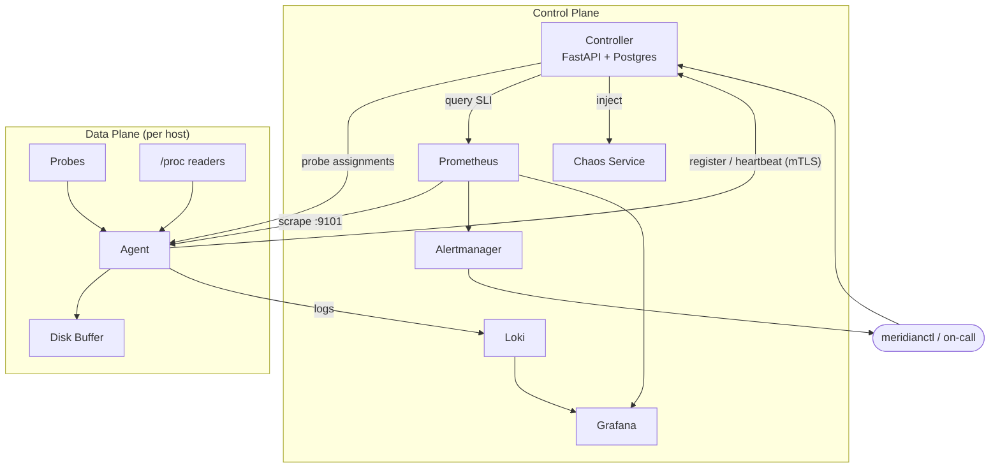

# Architecture

Meridian is a two-plane reliability platform: a **control plane** that decides
what should be measured and tracks the health of the fleet, and a **data plane**
of per-host agents that do the measuring.

## Design goals

1. **No single point of data loss.** An agent must survive a controller or
   collector outage without dropping telemetry. This drives the on-disk buffer.
2. **Uniform telemetry.** Every probe type emits the same metric shape so that
   one dashboard and one alert rule generalize across DNS, ICMP, TCP, HTTP, and
   traceroute.
3. **SLOs are the contract, not thresholds.** Alerting is driven by error-budget
   burn rate, not static thresholds. The SLO catalog is version-controlled.
4. **Least privilege everywhere.** The agent needs exactly one Linux capability
   (`CAP_NET_RAW`). The control plane is mutually authenticated with mTLS.
5. **Heterogeneity is a first-class concern.** The same artifacts deploy via
   Kubernetes, Ansible (bare metal), and are provisioned by Terraform.

## The two planes

## Why control-plane / data-plane separation

The agent must keep running and keep buffering even when the controller is
unavailable. By making the controller advisory (it distributes config and tracks
state, but the agent owns its own execution loop), a controller outage degrades
*management* but never *measurement*. See
[ADR-0002](adr/0002-control-data-plane-split.md).

## Component responsibilities

| Component | Owns | Does NOT own |
|---|---|---|
| Agent | probe execution, system metrics, buffering, local exposition | alerting decisions, storage of history |
| Controller | inventory, probe distribution, SLO evaluation, incidents | metric storage (that's Prometheus), probe execution |
| Prometheus | metric storage, recording rules, alert evaluation | probe scheduling |
| Alertmanager | routing, grouping, inhibition, silencing | deciding *what* is an alert |
| Chaos service | fault injection + auto-revert | deciding *when* to inject (controller does) |

## Three observability paths

Metrics, logs, and traces are kept on separate paths rather than being forced
through one pipeline. Metrics go Prometheus→Alertmanager/Grafana; logs go
agent→Loki→Grafana; traces (controller) go via OpenTelemetry. Conflating them is
a common anti-pattern that couples failure domains. See
[observability.md](observability.md).

## Failure modes considered

| Failure | Behavior |
|---|---|
| Controller down | Agents keep probing + buffering; heartbeats retry with backoff; Prometheus keeps scraping. Management is degraded, measurement is not. |
| Collector (Prometheus) down | Agent buffer fills to its cap, then evicts oldest. Local exposition still works for a co-located scraper. |
| Agent crash | systemd restarts it (`Restart=on-failure`); buffer segments survive and are drained on restart. |
| Postgres down | Controller readiness probe fails, taken out of rotation; agents unaffected. |
| Cert expiry | Cert watcher detects rotation; rotation playbook in [runbooks/cert-rotation.md](../runbooks/cert-rotation.md). |
| Network partition | Probes detect it (that's the point); inhibition rules stop alert storms. |

## Security model

mTLS on every control-plane hop. The agent holds a client cert; the controller
verifies it and maps the cert CN to an RBAC role
([config/controller/auth.yaml](../config/controller/auth.yaml)). Agents run as a
non-root system user with only `CAP_NET_RAW`. See [security.md](security.md) and
[ADR-0005](adr/0005-mtls-everywhere.md).

## Scaling posture

A single controller replica handles thousands of agents because the hot path
(heartbeats, scrapes) is cheap and the controller is stateless apart from
Postgres. Horizontal scaling is a matter of adding replicas behind the service.
See [scaling.md](scaling.md).
